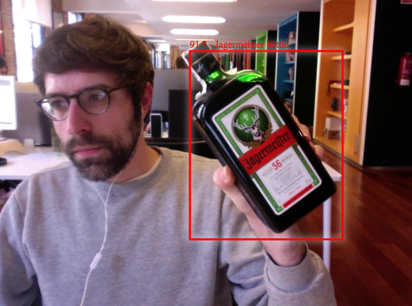

# tfjs-vue-example
This is a demo application that uses Vue.js and a webcam to detect Jagermeister bottles in video and/or images.
Code adapted to fit the requirements from the following project: [tfjs-coco-ssd-vue-example](https://github.com/freshsomebody/tfjs-coco-ssd-vue-example)

## Demo screenshot


## Project setup
```
npm install
```

### Compiles and hot-reloads for development
```
npm run serve
```

### Compiles and minifies for production
```
npm run build
```

### Serving custom model
Is important to copy your trained model into a folder called web_model in the root directory and the run:
```
node_modules/http-server/bin/http-server -c1 --cors .
```

### App url (in local dev server)
[http://localhost:8080/](http://localhost:8080/)

## References
- [A step-by-step guide on Medium](https://medium.com/@driagil/training-tensorflow-object-detection-api-with-custom-dataset-for-working-in-javascript-and-vue-js-6634e0f33e03)
- [Creating your own object detector with Tensorflow](https://towardsdatascience.com/creating-your-own-object-detector-ad69dda69c85)
